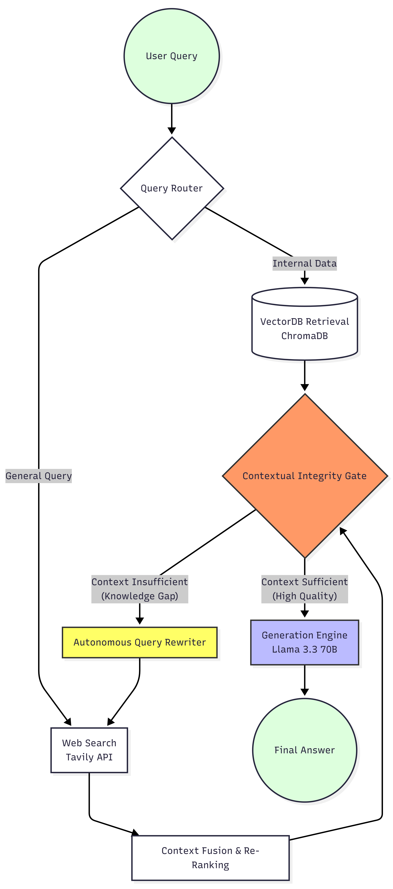
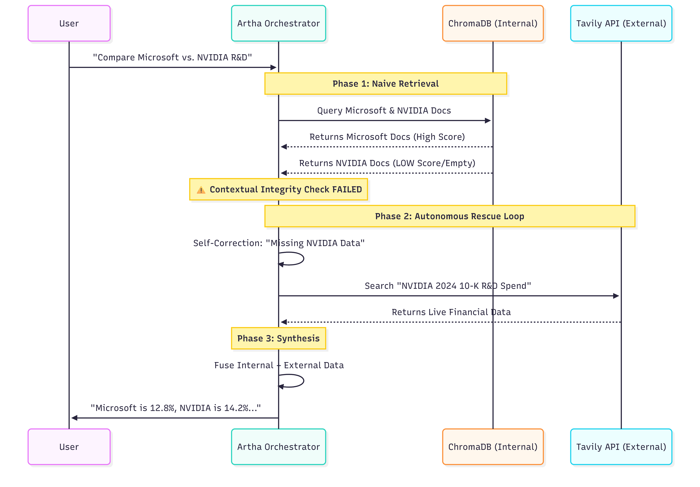

# Artha: Autonomous Financial Intelligence (Self-Correction RAG)


-success)

> **"Solving the Stochasticity of LLMs with Deterministic Control Flow."**

Traditional RAG systems suffer from **"Contextual Entropy"**—as the complexity of a financial query increases, the probability of retrieving accurate vector chunks approaches zero. Artha is an **Autonomous Agentic Workflow** designed to mitigate this failure mode.

It is not a chatbot. It is a **Stateful Reasoning Engine** that employs **Active Retrieval Augmented Generation (Active RAG)** to detect hallucinations, measure confidence scores, and self-correct via recursive web loops.

---

## 🧠 Core Engineering Philosophy

### **1. Beyond Linear Chains (The Cycle)**
Most AI projects use "Chains" (A → B → C). Chains are fragile; one failure breaks the pipeline.
Artha utilizes a **Cyclic Graph Architecture (LangGraph)**. This allows the system to **loop back** to previous states. If the `Grader Node` rejects a document, the system doesn't crash—it loops back to the `Search Node` with a refined query strategy.

### **2. Hallucination as a Control Flow Signal**
In standard systems, a missing answer is a failure. In Artha, **ignorance is a trigger.**
The system uses a binary grading mechanism to evaluate "Document Relevance" and "Hallucination." These boolean flags act as **Conditional Edges** in the graph, routing the execution flow dynamically between local vector stores and external search tools.

### **3. Just-in-Time (JIT) Visualization**
Financial data is useless without context. Artha includes a **Generative UI Engine**. The LLM detects when a user request implies a comparison (e.g., "vs", "compare", "trend") and autonomously generates and executes Python code to render **Plotly** charts in real-time, effectively writing its own frontend on the fly.

---

## 🏗️ Technical Architecture

The system is modeled as a **State Machine** with the following nodes and edges:

### **The Decision Graph**


### **The Self-Correction Loop (Sequence)**
The following sequence diagram illustrates the **"Rescue Branch"**—the precise moment the system detects semantic drift and executes a corrective web search.


---

## 📂 System Modules

| Module | Technical Function |
| :--- | :--- |
| **`graph.py`** | **The State Machine:** Defines the `StateGraph`, `END` nodes, and `ConditionalEdges`. This is the brain that orchestrates the cyclic flow. |
| **`ingest.py`** | **Vector Quantization:** Handles the chunking (RecursiveCharacterTextSplitter) and embedding of high-dimensional 10-K data into `ChromaDB`. |
| **`state.py`** | **Schema Definition:** Defines the `TypedDict` state object that persists context across graph nodes (preserving memory between cycles). |
| **`app.py`** | **Runtime Environment:** Streamlit-based event loop that renders the chat interface and executes the generated visualization code. |

---

## 🛠️ The Tech Stack (Deep Dive)

* **Orchestration:** **LangGraph** (Cyclic DAGs for Agentic Behaviors)
* **LLM Backend:** **Llama-3.3-70b-Versatile** (Hosted on Groq LPU for <100ms inference latency)
* **Vector Store:** **ChromaDB** (Local semantic index with HNSW indexing)
* **Search Tool:** **Tavily Search API** (Optimized for LLM-ready context extraction)
* **Frontend:** **Streamlit** (Reactive Python-based UI)

---

## 🚀 How to Replicate

**1. Clone the Neural Architecture**
```bash
git clone [https://github.com/vedthombre/artha-financial-ai-intelligence.git](https://github.com/vedthombre/artha-financial-ai-intelligence.git)
cd artha-financial-ai-intelligence
```
**2. Hydrate the Environment**
``` bash
python -m venv .venv
source .venv/bin/activate
pip install -r requirements.txt
```
**3.Inject API Credentials** 
Create a .env file to authenticate the inference and search engines: 
```bash
GROQ_API_KEY=gsk_...
TAVILY_API_KEY=tvly-...
```
**4. Ignite the Agent**
```bash 
streamlit run app.py
```
